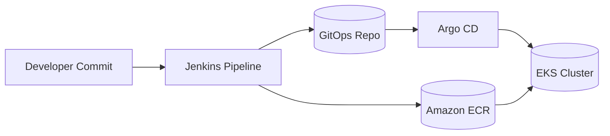

# lesson-8-9 — CI/CD з Jenkins → ECR → Argo CD (Helm, Terraform)

## Опис

У цьому проєкті реалізовано повний CI/CD-процес для Django-застосунку за допомогою **Jenkins**, **Terraform**, **Helm** та **Argo CD**. Пайплайн автоматично збирає Docker-образ, пушить його в Amazon ECR, оновлює Helm-чарт у GitOps-репозиторії та синхронізує зміни у кластері Kubernetes через Argo CD.

---

## Архітектура



---

## Кроки виконання

### 1. Terraform

* Створено модулі для **S3 + DynamoDB** (бекенд), **VPC**, **ECR**, **EKS**, **Jenkins**, **Argo CD**.
* `terraform.tfvars` містить усі необхідні змінні (region, bucket, cluster\_name тощо).
* Команди:

```bash
terraform init
terraform apply
```

### 2. Jenkins

* Встановлено через Helm (`modules/jenkins`).
* У `values.yaml` додано Kubernetes Cloud + pod template для Kaniko.
* Jenkinsfile у app-репо реалізує етапи:

    1. Build Docker image з Dockerfile.
    2. Push в Amazon ECR.
    3. Update `values.yaml` у GitOps-репозиторії.
    4. Push у main.

### 3. Argo CD

* Встановлено через Helm (`modules/argo_cd`).
* Application типу “app-of-apps” відслідковує GitOps-репо.
* Автоматична синхронізація (`automated.prune/selfHeal`).

### 4. GitOps Repo

* Містить Helm-чарт `charts/django-app/` із:

    * `deployment.yaml`
    * `service.yaml`
    * `values.yaml` (тут Jenkins оновлює тег образу).

---

## Як перевірити

### Terraform

```bash
terraform init
terraform apply
```

### Jenkins

* Перейти в UI Jenkins (портфорвард або LoadBalancer).
* Запустити пайплайн.
* Перевірити ECR:

```bash
aws ecr describe-images --repository-name django-app --query 'imageDetails[].imageTags[]'
```

* Перевірити GitOps-репо: коміт із новим тегом у `values.yaml`.

### Argo CD

* Портфорвардинг:

```bash
kubectl -n argocd port-forward svc/argo-cd-argocd-server 8080:80
```

* Логін:

```bash
kubectl -n argocd get secret argocd-initial-admin-secret -o jsonpath='{.data.password}' | base64 -d; echo
```

* Веб-інтерфейс: [http://localhost:8080](http://localhost:8080)
* Має бути застосунок **django-app** зі статусом **Synced/Healthy**.

---


